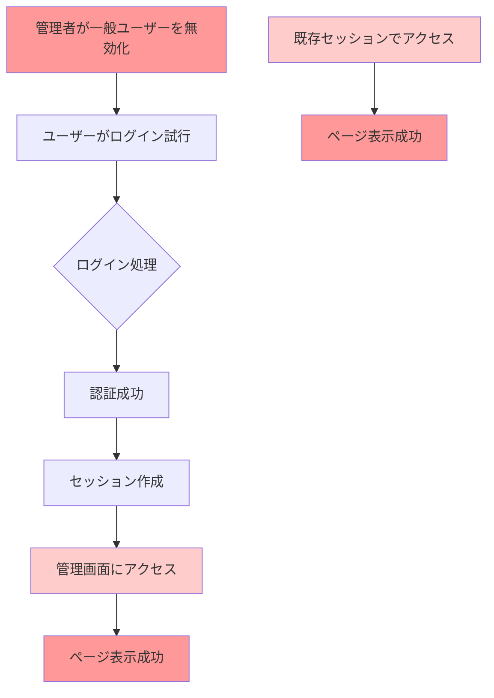
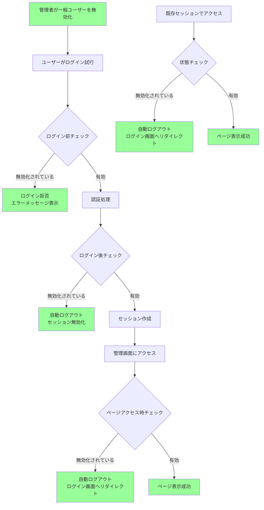
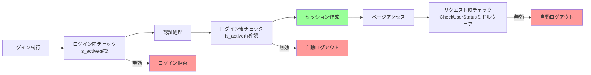

# 管理画面でのユーザー無効化後のログイン問題の修正

## 問題の背景

### 発見された問題
管理画面で一般ユーザー（`is_admin => false`）を無効化（`is_active => false`）しても、そのユーザーが引き続きログインできてしまう問題が発生していました。

### 問題の詳細
1. **ログイン処理の不備**: ログイン時にユーザーの有効状態（`is_active`）をチェックしていなかった
2. **認証後の状態チェック不足**: ログイン成功後にユーザーが無効化されても、セッションが継続していた
3. **ページアクセス時の保護不足**: 無効化されたユーザーが保護されたページ（管理画面、フォロワー関連画面）にアクセスできていた

### 影響範囲
- 管理画面への不正アクセス
- フォロワー統計・詳細画面への不正アクセス
- セキュリティ上の重大な問題

## 実装した修正内容

### 1. ログインコントローラーの強化

#### 修正前
```php
// ログイン処理でユーザーの有効状態をチェックしていない
if (Auth::attempt($credentials, $remember)) {
    $request->session()->regenerate();
    return redirect()->intended(route('admin.dashboard'));
}
```

#### 修正後
```php
// ログイン前のチェック
$user = \App\Models\User::where('email', $credentials['email'])->first();
if ($user && !$user->is_active) {
    throw ValidationException::withMessages([
        'email' => 'このアカウントは無効化されています。管理者にお問い合わせください。',
    ]);
}

// ログイン後の再チェック
if (Auth::attempt($credentials, $remember)) {
    $user = Auth::user();
    if (!$user->is_active) {
        Auth::logout();
        $request->session()->invalidate();
        $request->session()->regenerateToken();
        
        throw ValidationException::withMessages([
            'email' => 'このアカウントは無効化されています。管理者にお問い合わせください。',
        ]);
    }
    
    $request->session()->regenerate();
    return redirect()->intended(route('admin.dashboard'));
}
```

### 2. 認証ミドルウェアの追加

#### CheckUserStatusミドルウェア
```php
<?php

namespace App\Http\Middleware;

use Closure;
use Illuminate\Http\Request;
use Illuminate\Support\Facades\Auth;
use Symfony\Component\HttpFoundation\Response;

class CheckUserStatus
{
    public function handle(Request $request, Closure $next): Response
    {
        if (Auth::check()) {
            $user = Auth::user();
            
            // ユーザーが無効化されている場合はログアウト
            if (!$user->is_active) {
                Auth::logout();
                $request->session()->invalidate();
                $request->session()->regenerateToken();
                
                return redirect()->route('login')
                    ->withErrors(['email' => 'このアカウントは無効化されています。管理者にお問い合わせください。']);
            }
        }

        return $next($request);
    }
}
```

### 3. ミドルウェアの登録

#### bootstrap/app.php
```php
->withMiddleware(function (Middleware $middleware): void {
    $middleware->alias([
        'admin' => \App\Http\Middleware\AdminMiddleware::class,
        'check.user.status' => \App\Http\Middleware\CheckUserStatus::class,
    ]);
})
```

### 4. ルートへの適用

#### 管理画面ルート
```php
// 管理画面のルート（認証必須）
Route::prefix('admin')->name('admin.')->middleware(['auth', 'check.user.status'])->group(function () {
    // ... 各ルート
});
```

#### フォロワー関連ルート
```php
// GitHubフォロワー情報ルート（認証必須）
Route::prefix('github')->name('github.')->middleware(['auth', 'check.user.status'])->group(function () {
    // ... 各ルート
});
```

### 5. Userモデルの拡張

#### 追加されたフィールドとメソッド
```php
protected $fillable = [
    'name',
    'email',
    'password',
    'is_admin',
    'is_active', // 新規追加
];

protected function casts(): array
{
    return [
        'email_verified_at' => 'datetime',
        'password' => 'hashed',
        'is_admin' => 'boolean',
        'is_active' => 'boolean', // 新規追加
    ];
}

// 新規追加されたメソッド
public function isActive(): bool
{
    return $this->is_active;
}

public function scopeActive($query)
{
    return $query->where('is_active', true);
}

public function scopeRegularUsers($query)
{
    return $query->where('is_admin', false);
}
```

## セキュリティの向上

### 二重チェックシステム
1. **ログイン時チェック**: ログイン試行前にユーザー状態を確認
2. **認証後チェック**: ログイン成功後にユーザー状態を再確認
3. **リクエスト時チェック**: 各ページアクセス時にユーザー状態を確認

### 自動ログアウト機能
- 無効化されたユーザーは自動的にセッションから除外
- セッションの無効化とトークンの再生成
- 適切なエラーメッセージとともにログイン画面にリダイレクト

### エラーハンドリング
- ユーザーフレンドリーなエラーメッセージ
- 何が起こったかを明確に伝達
- 管理者への問い合わせ案内

## 動作の流れ

### 問題発生時の流れ（修正前）


**問題点**: 無効化されたユーザーでもログインでき、保護されたページにアクセスできてしまう

### 修正後の流れ



**修正効果**: 無効化されたユーザーは完全にブロックされ、セキュリティが確保される

### セキュリティチェックの詳細



**二重チェックシステム**: ログイン時とリクエスト時の両方でユーザー状態を確認

## 今後の改善点

### 監査ログの追加
- ユーザーの無効化/有効化の履歴
- ログイン試行の記録
- セキュリティイベントの追跡

### 通知機能の強化
- 管理者への無効化通知
- ユーザーへの状態変更通知
- セキュリティアラート

### セッション管理の最適化
- セッションタイムアウトの設定
- 同時ログイン制限
- デバイス認証の強化

## 結論

今回の修正により、管理画面でユーザーを無効化した際のセキュリティ問題が解決されました。二重チェックシステムと自動ログアウト機能により、無効化されたユーザーがシステムにアクセスすることを完全に防ぐことができます。

セキュリティの観点から、ユーザー管理機能は適切に保護され、システム全体の安全性が大幅に向上しました。
