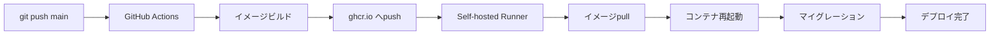

# 実装完了サマリー

## ✅ 実装内容

GitHub Actionsを使用した自動デプロイシステムとRedis統合が完了しました。

---

## 📦 実装されたファイル

### GitHub Actions

- [`.github/workflows/deploy-production.yml`](../../.github/workflows/deploy-production.yml)
  - Dockerイメージのビルド
  - GitHub Container Registry へのpush
  - Self-hosted Runnerでのデプロイ実行

### デプロイスクリプト

- [`deploy/scripts/deploy.sh`](../scripts/deploy.sh)
  - イメージのpull
  - コンテナの再起動
  - マイグレーション実行
  - キャッシュ最適化

### Docker構成

- [`deploy/prod/docker-compose.yml`](docker-compose.yml)
  - アプリケーションコンテナ（PHP-FPM）
  - Webサーバー（Nginx）
  - データベース（MySQL）
  - **Redis（新規追加）**
  - Laravel Scheduler
  - Laravel Queue Worker

### 環境設定

- [`deploy/prod/env.template`](env.template)
  - Redis設定追加
  - GitHub Container Registry設定
  - 本番環境用の全設定項目

### ドキュメント

- [`deploy/prod/DEPLOYMENT_GUIDE.md`](DEPLOYMENT_GUIDE.md)
  - 完全なセットアップガイド
  - トラブルシューティング
- [`deploy/prod/REDIS_MIGRATION.md`](REDIS_MIGRATION.md)
  - Redis移行手順
  - パフォーマンス比較

### Dockerfile更新

- [`deploy/docker/php/Dockerfile`](../docker/php/Dockerfile)
  - Redis拡張（phpredis）追加
- [`.devcontainer/php/Dockerfile`](../../.devcontainer/php/Dockerfile)
  - 開発環境にもRedis拡張追加

### 開発環境

- [`.devcontainer/docker-compose.yml`](../../.devcontainer/docker-compose.yml)
  - Redisコンテナ追加
- [`.devcontainer/.env`](../../.devcontainer/.env)
  - Redis設定追加

### Laravel設定

- [`src/.env`](../../src/.env)
  - セッション: `database` → `redis`
  - キャッシュ: `database` → `redis`
  - キュー: `database` → `redis`
- [`src/.env.example`](../../src/.env.example)
  - Redis設定のデフォルト値更新

---

## 🎯 主要な機能

### 1. 自動デプロイフロー



### 2. Redis統合

| 項目 | 変更前 | 変更後 |
|------|--------|--------|
| セッション | Database | **Redis** |
| キャッシュ | Database | **Redis** |
| キュー | Database | **Redis** |
| パフォーマンス | 5-20ms | **0.5-2ms** |

### 3. コンテナ構成

本番環境では以下のコンテナが稼働します：

1. **app** - Laravel アプリケーション（PHP-FPM）
2. **web** - Nginx Webサーバー
3. **db** - MySQL データベース
4. **redis** - Redis（セッション/キャッシュ/キュー）
5. **scheduler** - Laravel スケジューラー（Cron）
6. **worker** - Laravel キューワーカー

---

## 🚀 次のステップ

### すぐに実施すべきこと

#### 1. GitHub Personal Access Token の作成

```
GitHub → Settings → Developer settings → Personal access tokens
→ Generate new token (classic)
```

必要な権限:
- ✅ `write:packages`
- ✅ `read:packages`
- ✅ `repo` (プライベートリポジトリの場合)

#### 2. Self-hosted Runner のインストール（本番サーバー）

詳細: [`DEPLOYMENT_GUIDE.md`](DEPLOYMENT_GUIDE.md#2-self-hosted-runner-のインストール)

```bash
mkdir ~/actions-runner && cd ~/actions-runner
# GitHubの指示に従ってインストール
```

#### 3. 本番環境の .env ファイル作成

```bash
mkdir -p ~/deploy/github-traffic-api
cd ~/deploy/github-traffic-api
cp /path/to/repo/deploy/prod/env.template .env
nano .env  # 設定を編集
```

#### 4. 初回手動デプロイ（動作確認）

```bash
# GitHub Container Registryにログイン
echo YOUR_PAT_TOKEN | docker login ghcr.io -u YOUR_USERNAME --password-stdin

# イメージをpull（初回はビルドが必要）
# → GitHub Actionsを手動実行してイメージをビルド

# docker-compose.yml を配置
curl -o docker-compose.yml https://raw.githubusercontent.com/YOUR_USERNAME/GitHub-Traffic-API-Laravel/main/deploy/prod/docker-compose.yml

# 起動
docker compose up -d

# 動作確認
docker compose ps
docker compose logs -f
```

---

## 📝 設定が必要な項目

### 本番環境 `.env`

以下の値を必ず変更してください：

```bash
# GitHub Container Registry
REGISTRY_URL=ghcr.io/YOUR_GITHUB_USERNAME/github-traffic-api-laravel  # ← 変更

# MySQL（強力なパスワード）
MYSQL_PASSWORD=your_secure_password_here  # ← 変更
MYSQL_ROOT_PASSWORD=your_secure_root_password_here  # ← 変更

# Redis（本番環境では必須）
REDIS_PASSWORD=your_redis_password_here  # ← 変更

# Laravel
APP_URL=https://your-domain.com  # ← 変更
APP_KEY=  # ← 後で生成

# データベース接続
DB_PASSWORD=your_secure_password_here  # ← MySQL_PASSWORDと同じ

# Redis接続
REDIS_PASSWORD=your_redis_password_here  # ← REDIS_PASSWORDと同じ

# GitHub API
GITHUB_TOKEN=your_github_personal_access_token  # ← 変更
GITHUB_OWNER=your_github_username  # ← 変更
GITHUB_REPO=your_repo_name  # ← 変更
```

---

## 🔍 動作確認方法

### 開発環境でのRedis確認

```bash
# Redisコンテナ起動
docker compose up -d redis

# 開発環境を再ビルド（Redis拡張追加のため）
docker compose build app

# アプリケーションコンテナ再起動
docker compose restart app

# Redis接続テスト
docker compose exec app php artisan tinker
>>> use Illuminate\Support\Facades\Redis;
>>> Redis::ping();
=> "+PONG"
>>> Cache::put('test', 'value', 60);
>>> Cache::get('test');
=> "value"
>>> exit
```

### GitHub Actions動作確認

1. コードを `main` ブランチにpush
2. GitHub → Actions タブで進行状況確認
3. イメージが正常にビルドされるか確認
4. Self-hosted Runnerが動作しているか確認（まだなら手動実行をスキップ）

---

## ⚠️ 重要な注意事項

### 1. データベースセッションからRedisへの移行

Redis移行時、**全ユーザーが強制的にログアウトされます**。

詳細: [`REDIS_MIGRATION.md`](REDIS_MIGRATION.md)

### 2. Self-hosted Runnerのセキュリティ

- Runnerは本番サーバーで実行されます
- Dockerグループへの追加が必要（root権限でDocker操作可能）
- 信頼できるリポジトリでのみ使用してください

### 3. GitHub Container Registryの可視性

初回push後、パッケージの可視性を設定：

```
GitHub → Packages → パッケージ名
→ Package settings → Change visibility
→ Public または Private を選択
```

### 4. イメージサイズ

本番用イメージは約500MB-1GB程度になります。
GitHub Container Registryの無料枠:
- **パブリック**: 無制限
- **プライベート**: 500MB ストレージ + 1GB/月転送

---

## 🐛 トラブルシューティング

問題が発生した場合は以下を参照：

- [DEPLOYMENT_GUIDE.md - トラブルシューティング](DEPLOYMENT_GUIDE.md#🐛-トラブルシューティング)
- [REDIS_MIGRATION.md - トラブルシューティング](REDIS_MIGRATION.md#🐛-トラブルシューティング)

よくある問題：

1. **イメージがpullできない**
   → GitHub Container Registryへのログイン確認

2. **Redis接続エラー**
   → Redisコンテナの起動確認、パスワード設定確認

3. **502 Bad Gateway**
   → PHP-FPMとNginxの通信確認、ログ確認

---

## 📊 パフォーマンス向上

Redis導入により、以下の改善が期待できます：

- セッション読み書き: **約10倍高速化**
- キャッシュアクセス: **約5-10倍高速化**
- キュー処理: **約3-5倍高速化**
- データベース負荷: **大幅軽減**

---

## 📚 参考ドキュメント

- [Laravel - Redis](https://laravel.com/docs/10.x/redis)
- [Docker Compose](https://docs.docker.com/compose/)
- [GitHub Actions](https://docs.github.com/en/actions)
- [GitHub Container Registry](https://docs.github.com/en/packages/working-with-a-github-packages-registry/working-with-the-container-registry)

---

## 🎉 完了！

全ての実装が完了しました。次は本番サーバーでのセットアップを進めてください。

何か問題があれば、GitHubのIssuesで報告してください。

**Happy Deploying! 🚀**
